<div align="center">

</div>

---

# Sumário

[1. Introdução](#c1)

[2. Didática da Ideia e Produto](#c2)

[3. Arquitetura da Solução](#c3)

[4. Viabilidade e próximos passos](#c4)

[5. Referências](#c5)

---

#  <a name="c1"></a> **1\. Introdução**

 O Brasil enfrenta uma crise silenciosa no campo das finanças pessoais entre jovens de 18 a 30 anos. Apesar de serem a geração mais conectada da história, imersa em cultura digital, redes sociais e estímulos visuais, muitos jovens não recebem educação financeira adequada. Os métodos tradicionais, densos e pouco interativos, não conseguem engajar esse público, criando uma lacuna entre o aprendizado e a prática financeira necessária para a vida adulta.

#  <a name="c2"></a> **2\. Didática da Ideia e Produto**

Esta seção apresenta a estratégia do **PoupaZenda** para combater o endividamento juvenil através da gamificação. São detalhados a metodologia de ensino visual, o design do jogo e o perfil do público-alvo, demonstrando como a solução transforma conceitos financeiros complexos em aprendizado prático e acessível.

## **2.1. Contextualização do problema**

Os jovens brasileiros enfrentam um cenário crítico de educação financeira. Levantamentos do **Serviço de Proteção ao Crédito (SPC Brasil)** e do **Centro Paula Souza** mostram que mais de **12,5 milhões de jovens entre 18 e 30 anos** estão endividados. Já a **Confederação Nacional de Dirigentes Lojistas (CNDL)** aponta que **75% dos jovens** não têm controle estruturado de gastos.

O estudo **“Educação Financeira 4.0”** do **SPC Brasil** revela que **19% dos jovens de 18 a 24 anos** e **46% entre 25 e 29 anos** possuem dívidas, reflexo da falta de conhecimento sobre juros, crédito e organização financeira.

Com renda baixa ou instável e forte influência das redes sociais, muitos jovens tomam decisões impulsivas e têm dificuldade para entender conceitos básicos. Métodos tradicionais, pouco interativos, não ajudam a transformar teoria em prática, perpetuando o ciclo de endividamento.

Diante disso, torna-se urgente oferecer soluções práticas e acessíveis que tornem o aprendizado financeiro mais claro e aplicável ao dia a dia.

## **2.2. Visão do Produto e Didática**

  Apesar do acesso à informação e à tecnologia, muitos jovens de 18 a 30 anos não internalizam conceitos financeiros essenciais. Métodos tradicionais de ensino não conectam com a forma como essa geração aprende, resultando em decisões impulsivas, endividamento e dificuldade em planejar o futuro. Esse desafio abre espaço para soluções inovadoras que tornem o aprendizado financeiro prático, envolvente e lúdico.

## **2.3. Solução** 

O vídeo mostra a solução como um todo envolvente e lúdico, permitindo visualizar claramente como a proposta do PoupaZenda transforma educação financeira em uma experiência prática e divertida. Segue o link do vídeo: [KMK](https://drive.google.com/drive/folders/1LU5iTXbA1DST3CHw1oTcyt-879XPq81k)

  Para enfrentar esse desafio, apresentamos **PoupaZenda**, um jogo de fazenda que revoluciona a educação financeira para jovens. O jogador administra sua própria fazenda, tomando decisões estratégicas sobre plantio, colheita, investimentos e gestão de recursos. Cada ação do jogador tem consequências diretas e visíveis permitindo que ele aprenda de forma prática conceitos financeiros essenciais, como poupança, investimentos, juros, dívidas e fluxo de caixa. 

  No PoupaZenda, conceitos financeiros são ensinados por meio de analogias visuais e lógicas que transformam decisões em efeitos concretos na fazenda. Cada escolha de investimento, planejamento ou consumo imediato gera resultados instantâneos e visíveis, como crescimento dos cultivos ou redução na produção por ervas daninhas. Essa dinâmica estimula o aprendizado emocional e prático: o jogador percebe rapidamente como suas ações afetam o desempenho da fazenda, tornando mais fácil absorver conteúdos complexos e desenvolver hábitos financeiros positivos de forma divertida e envolvente.

  Além disso, PoupaZenda foi projetado para gerar satisfação imediata e senso de conquista. O progresso na fazenda funciona como uma recompensa visual e emocional, incentivando o jogador a continuar aprendendo e aplicando conceitos financeiros de maneira consistente. Essa abordagem melhora o aprendizado, estimulando o jovem a entender boas práticas financeiras enquanto vê, na tela, reflexos diretos do seu progresso.O PoupaZenda não apenas ensina finanças, mas transforma o aprendizado em uma experiência divertida, motivadora e profundamente impactante, capaz de preparar jovens para decisões financeiras conscientes na vida real.

## **2.4. Inovação e Diferencial**

O **PoupaZenda** inova ao transformar conceitos financeiros complexos em uma experiência de jogo acessível, visual e conectada à realidade econômica brasileira. Em vez de apenas explicar investimentos, juros e risco, o projeto usa metáforas de fazenda (plantar, colher, cuidar da terra) ligadas a indicadores reais como CDI e IPCA, permitindo que o jovem “sinta na pele” as consequências de suas decisões.

**O que existe hoje parecido**

* Aplicativos de educação financeira baseados em vídeos e quizzes estáticos, sem narrativa contínua ou vínculo direto com decisões do dia a dia.

* Simuladores de investimento de bancos e corretoras focados em números e gráficos, voltados para quem já tem alguma familiaridade com o sistema financeiro.

* Jogos de fazendinha ou gestão de recursos que trabalham apenas mecânicas de “plantar e colher”, sem conexão com indicadores econômicos reais nem foco em formação financeira.

**Por que o PoupaZenda é diferente**

* **Metáforas visuais claras:** cada cultivo representa um tipo de produto financeiro (ex.: alface \= investimento conservador, feijão \= inflação/IPCA, sementes especiais \= maior risco), facilitando o entendimento intuitivo.

* **Conexão com a economia real:** rendimentos e eventos do jogo são ajustados por indicadores reais (como CDI e IPCA), mostrando na prática como mudanças econômicas afetam o “resultado da fazenda” do jogador.

* **Caseiro IA contextual:** um NPC com IA que conversa em linguagem simples, explica conceitos com base nas ações do jogador e oferece dicas personalizadas, aproximando o conteúdo da realidade do jovem.

* **Foco em jovens brasileiros iniciando a vida financeira:** narrativa, visual e exemplos pensados para o contexto BR (primeiro cartão de crédito, dívidas pequenas, metas de curto prazo).

* **Aprender fazendo (e não só assistindo):** o jogador experimenta, erra e ajusta a estratégia na fazenda, internalizando conceitos como risco, prazo e juros compostos de forma lúdica e prática.

## **2.5. A Metodologia Didática** -didática}

A didática do PoupaZenda é baseada em analogias visuais e lógicas, que tornam conceitos financeiros complexos fáceis de entender e aplicar

Essas metáforas permitem que o jovem entenda de forma instantânea e intuitiva conceitos que normalmente levariam horas de explicação teórica

Tabela 1: Metodologia do jogo

| Elemento do Jogo | Conceito Financeiro | Explicação |
| :---: | :---: | :---: |
| **Alface** | **CDI/Poupança** | **Cresce com o tempo, mostrando rendimentos seguros.** |
| **Milho** | **Dívidas / Juros** | **Crescem descontroladamente se não forem removidas, impactando a fazenda.** |
| **Água** | **Liquidez / Caixa** | **Mantém a fazenda funcionando, como o fluxo de caixa na vida real.** |
| **Sementes especiais** | **Investimentos de Risco** | **Podem gerar altos retornos ou perdas, ensinando a lidar com risco.** |
| **Árvore Frutífera** | **Juros Compostos** | **Cresce mais a cada ciclo de colheita, mostrando como os rendimentos se acumulam ao longo do tempo.** |
| **Galinha** | **Renda Extra / Trabalho** | **Produz ovos regularmente, representando ganhos recorrentes e a importância de diversificar fontes de renda.** |
| **Colheita** | **Retorno financeiro** | **Resultado das decisões do jogador, reforçando planejamento e paciência.** |

Fonte: Material produzido pelos autores (2025)

  No PoupaZenda, o jogador aprende a escolher entre diferentes investimentos, planejar metas e decidir entre consumo imediato ou retorno futuro. Cada decisão gera um efeito direto, visual e imediato na fazenda:

**Decisão acertada** → a fazenda prospera, os cultivos crescem, as árvores frutíferas dão mais frutos, e as galinhas produzem ovos regularmente.

**Decisão equivocada** → ervas daninhas crescem descontroladamente, a produção diminui e o fluxo de caixa da fazenda é afetado.

  Esse ciclo transforma conteúdos complexos em aprendizado emocional, concreto e memorável, permitindo que o jogador veja de forma clara o impacto de suas próprias escolhas financeiras e desenvolva hábitos positivos de maneira divertida e prática.

## **2.6. Guia de estilos** -estilos}

Guia de estilos é um documento que define os padrões visuais e de comunicação de um produto ou marca. Nele ficam registrados itens como paleta de cores, tipografia, uso de logotipo, ícones e ilustrações, garantindo consistência em todas as peças e telas produzidas. Abaixo na figura 1 há o guia de estilos do  PoupaZenda:

<div align="center">
 <sub>Figura 1 – Guia de estilos</sub><br><br>
 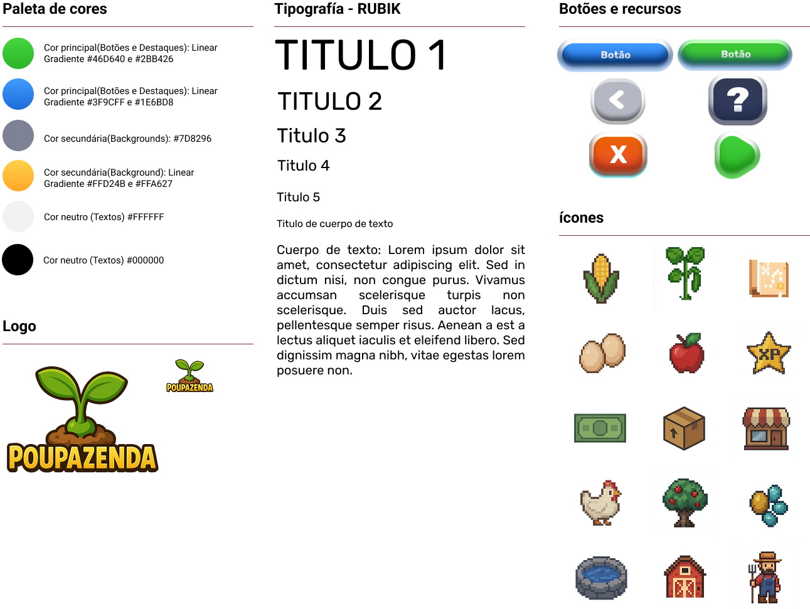<br>
 <sup>Fonte: Elaborado pelos autores (2025)</sup>
</div>

Em resumo, o guia de estilos da Poupazenda garante que todas as telas, ícones, NPCs, elementos de fazenda e metáforas de finanças pessoais sejam apresentados de forma coerente e reconhecível. Ao seguir esses padrões visuais e de comunicação, mantemos a experiência do jogador clara, divertida e educativa, reforçando a proposta do jogo de ensinar sobre dinheiro por meio da fazenda de forma simples e consistente.

Caso queira acessar o guia de estilos por completo é só clicar nesse link: [Link do Guia de estilos](https://www.figma.com/design/aXDiQg7h1Hh8V0Pw4n2mfe/Fazenda?node-id=235-20&p=f&t=KkKFyxykyysVhqop-0)

## **2.7. Protótipo** 

Protótipo é uma versão inicial e simplificada de um produto, feita para testar ideias antes do desenvolvimento final. No contexto do nosso jogo, o protótipo reúne telas, fluxos e mecânicas básicas da Poupazenda para validar a experiência do jogador, identificar ajustes necessários e alinhar a equipe sobre como o jogo deve funcionar, sem precisar ter tudo pronto ou visualmente finalizado.

* **Splash Screen e tela inicial**

<div align="center">
 <sub>Figura 2: Splash screen e tela inicial</sub><br><br>
 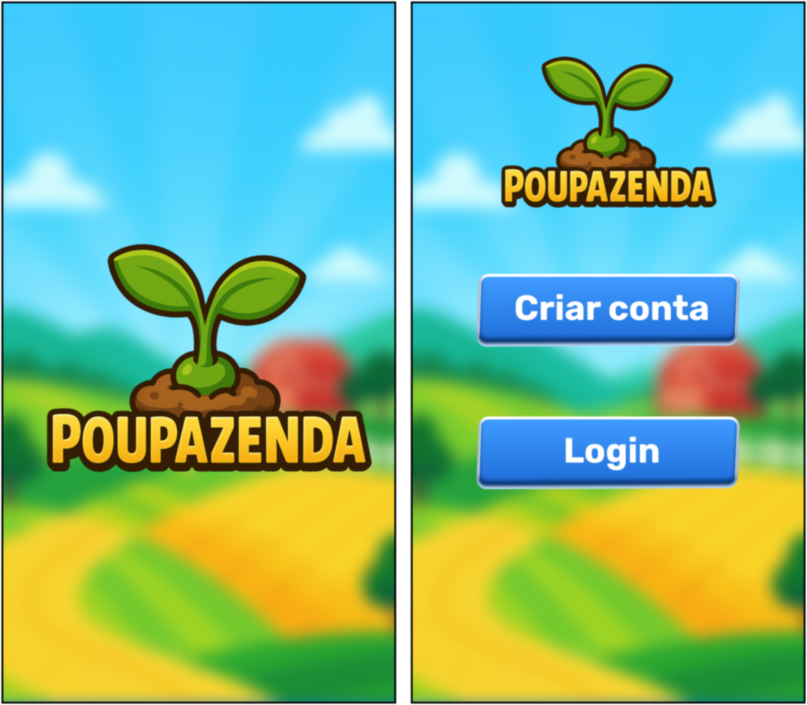<br>
 <sup>Fonte: Elaborado pelos autores (2025)</sup>
</div>

* **Tela de cadastro e personalização**

<div align="center">
 <sub>Figura 3: Tela de cadastro e personalização</sub><br><br>
 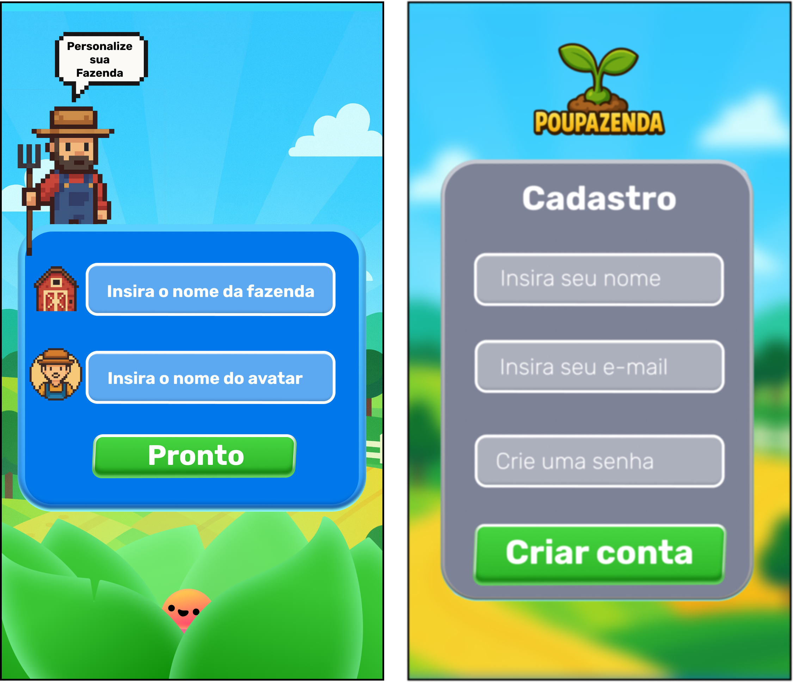<br>
 <sup>Fonte: Elaborado pelos autores (2025)</sup>
</div>


**Telas de tutorial**


<div align="center">
 <sub>Figura 4: Tutorial do jogo/sub><br><br>
 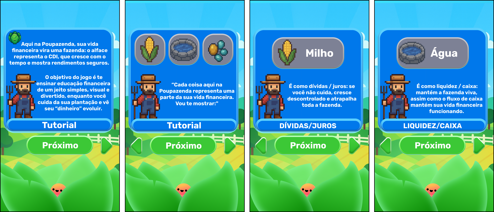<br>

<div align="center">
 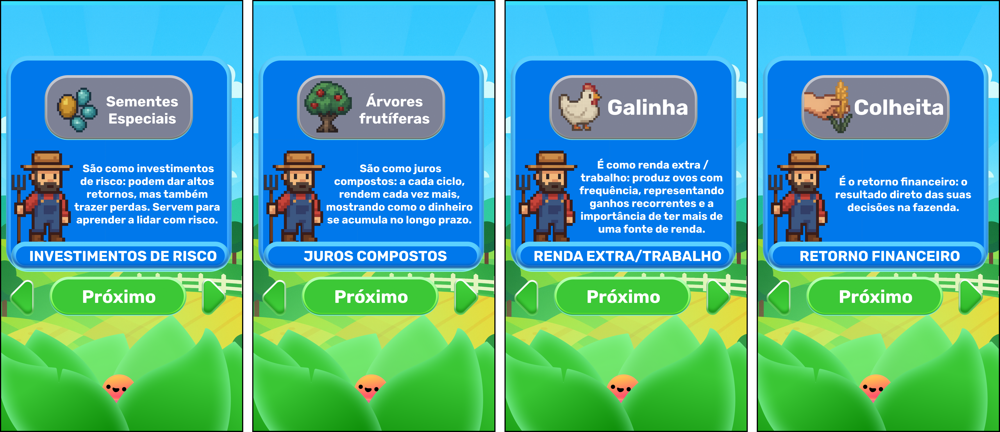<br>
</div>

<div align="center">
 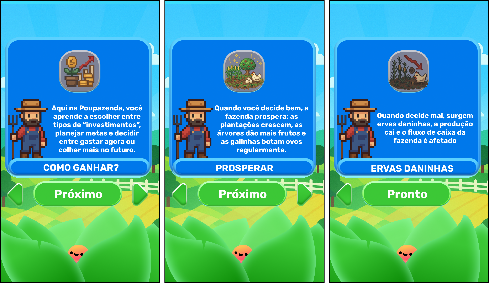<br>
</div>
 <sup>Fonte: Elaborado pelos autores (2025)</sup>
</div>

* **Telas da fazenda**

Figura 5: Tela de fazenda do jogo

<div align="center">
 <sub>Figura 5: Tela de fazenda do jogo</sub><br><br>
 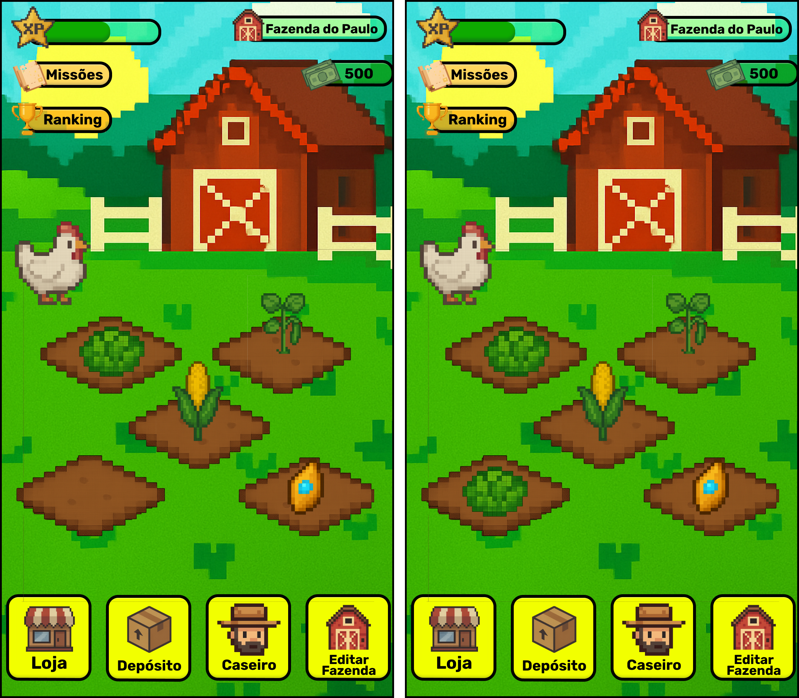<br>
 <sup>Fonte: Elaborado pelos autores (2025)</sup>
</div>

* **Telas da loja**

<div align="center">
 <sub>Figura 6: Telas da loja do jogo</sub><br><br>
 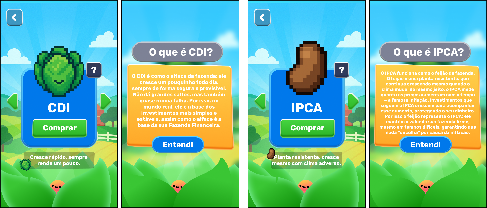<br>
 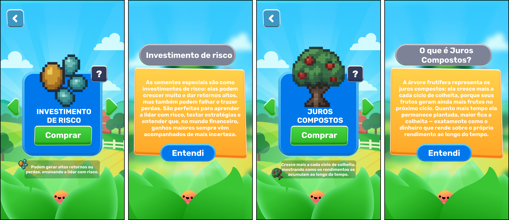<br>
 <sup>Fonte: Elaborado pelos autores (2025)</sup>
</div>

* **Telas do depósito**

<div align="center">
 <sub>Figura 7: Depósito do jogo</sub><br><br>
 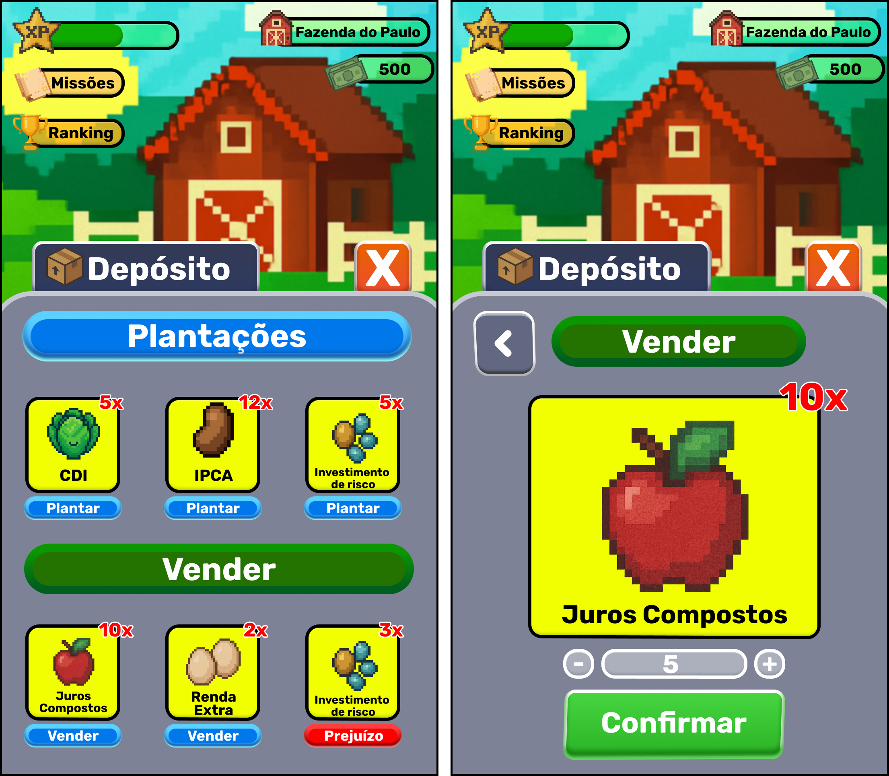<br>
 <sup>Fonte: Elaborado pelos autores (2025)</sup>
</div>

* **Tela de Chat com o caseiro I.A**

<div align="center">
 <sub>Figura 8: Tela do chat com I.A</sub><br><br>
 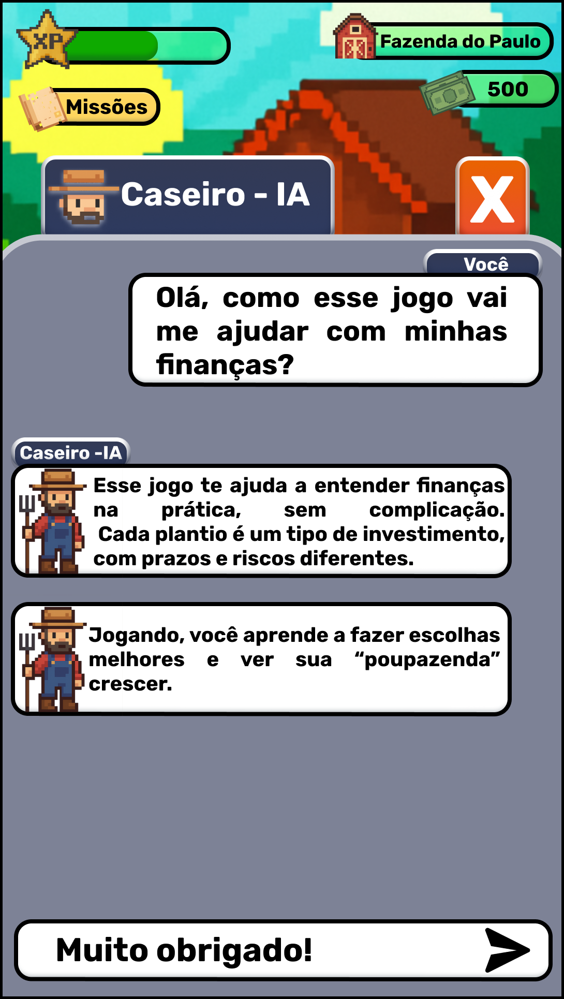<br>
 <sup>Fonte: Elaborado pelos autores (2025)</sup>
</div>

* **Telas de missão e Quiz**

<div align="center">
 <sub>Figura 9: Tela de missão e quiz do jogo</sub><br><br>
 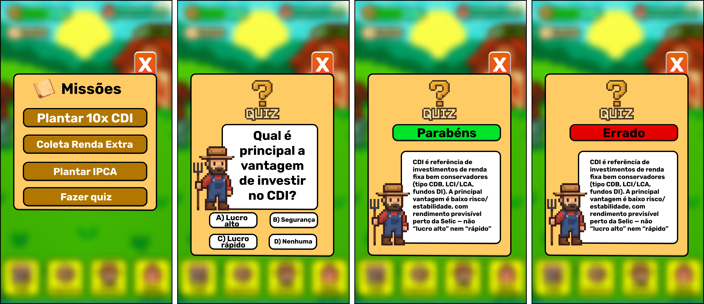<br>
 <sup>Fonte: Elaborado pelos autores (2025)</sup>
</div>

* **Tela de Ranking**

<div align="center">
 <sub>Figura 10: Tela de ranking/sub><br><br>
 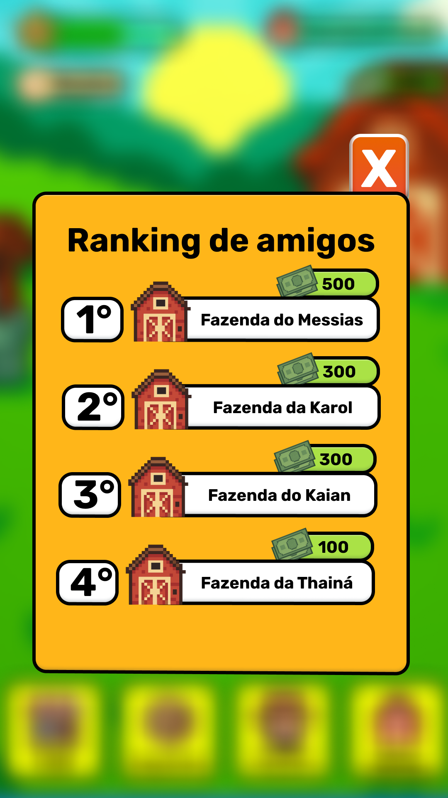<br>
 <sup>Fonte: Elaborado pelos autores (2025)</sup>
</div>

Em conclusão, o protótipo da PoupaZenda funciona como um rascunho jogável do nosso jogo, permitindo testar a navegação, as mecânicas de plantio e colheita e a forma como explicamos os conceitos financeiros. A partir dele, conseguimos identificar melhorias, validar se a experiência está clara e engajante para o jogador e reduzir erros antes de investir tempo e recursos na versão final do produto.

Para verificar o nosso protótipo com fluxo de navegação é só clicar [neste link](https://www.figma.com/design/aXDiQg7h1Hh8V0Pw4n2mfe/Fazenda?node-id=0-1&p=f&t=KkKFyxykyysVhqop-0)

## **2.8. Mecânicas do jogo**

Mecânicas de jogo são as regras, regras ou ações que definem como um jogo funciona para o jogador, ou seja, são as engrenagens que o fazem funcionar. Elas abrangem todas as ações que o jogador pode executar (como pular, atirar, mover peças) e as interações com o jogo (coleta de conjuntos, lançamento de dados).

<div align="center">
<sup>
Tabela 2: Mecânicas do jogo PoupaZenda
</sup>
</div>

| Mecânica | Descrição resumida | Regras principais | Objetivo pedagógico |
| ----- | ----- | ----- | ----- |
|    **Loja (comprar)** |  Jogador compra sementes,árvores, animais e itens especiais usando a moeda do jogo | Acesso pela logo da loja; cada item mostra preço, risco e tempo de retorno; ao comprar, o recurso vai para o inventário. |  Simular a escolha de investimentos considerando custo, risco e tempo de retorno. |
|  **Plantar** |  Jogador escolhe um terreno e planta um recurso comprado | Seleciona terreno livre; escolhe recurso do inventário; inicia contador de tempo; cada plantio tem risco, prazo e retorno. | Ensinar que investimentos têm prazos e riscos diferentes e que a alocação impacta o resultado. |
|  **Colher e vender** |  Jogador colhe a produção e vende para gerar moeda | Quando pronto aparece indicador; colhe → vai ao Depósito; no Depósito escolhe o que vender; pode dar lucro, empate ou perda. |  Mostrar que investimento pode dar lucro ou prejuízo e que não há garantia de retorno. |
|  **Ranking** | Mostra a posição do jogador em relação a outros | Calculado por patrimônio total e/ou XP; pode ter ranking global, semanal ou por grupo/turma. | Estimular engajamento e mostrar o impacto acumulado de boas decisões financeiras. |
|  **Caseiro IA** |  NPC assistente que responde dúvidas e dá dicas | Acesso por ícone; jogador faz perguntas sobre o jogo e finanças; IA responde em  linguagem simples e temática da fazenda. | Explicar conceitos no contexto do jogo (just-in-time learning) sem quebrar a imersão. |
|  **Moeda do jogo** |  Moeda virtual usada para todas as ações de compra e como medida de progresso | Ganha com vendas, missões, quizzes e marcos; gasta na compra de recursos e desbloqueios; saldo sempre visível ao jogador. |  Representar o fluxo de dinheiro (entrada, saída, planejamento e priorização). |
|  **Quiz** | Perguntas rápidas sobre educação financeira ligadas às situações da fazenda | Ativados em eventos (colheitas, diálogos, missões); resposta certa dá moeda/XP/itens; pode ter tentativas limitadas. | Reforçar o aprendizado de forma ativa, checando se o jogador entendeu os conceitos. |
|  **Missões** |  Objetivos que guiam o jogador em metas claras | Acesso por ícone; cada missão tem objetivo, passos e recompensa; pode ser diária ou de progressão (capítulos da jornada). | Conectar a experiência do jogo com metas financeiras reais (guardar, organizar, construir reserva). |
|  **Estado da fazenda** |  Visual da fazenda muda conforme as decisões financeiras | Boas decisões → plantações bonitas, árvores cheias, animais produtivos; más decisões → ervas daninhas, seca, baixa produção. |  Dar feedback visual imediato sobre a qualidade das escolhas financeiras ao longo do tempo. |

<div align="center">
<sup>
Fonte: Material produzido pelos autores (2025)
</sup>
</div>

As mecânicas do Poupazenda foram pensadas para que cada ação do jogador como comprar, plantar, esperar, colher, vender, cumprir missões, fazer quizzes e interagir com o caseiro IA, represente uma decisão financeira do dia a dia. A fazenda funciona como um espelho da vida real: quando o jogador entende risco, prazo e retorno, a fazenda prospera; quando toma decisões impulsivas, sente o impacto no visual e no saldo. Assim, o jogo não ensina apenas “na teoria”, mas por meio da experimentação: o jogador erra, ajusta a estratégia e aprende jogando, criando uma relação mais leve, visual e intuitiva com o mundo das finanças.

## **2.9. Personas** 

Personas são representações semi-fictícias dos usuários reais, construídas a partir de dados, comportamentos, motivações e desafios identificados no público-alvo. Elas ajudam a compreender como diferentes perfis pensam, aprendem e tomam decisões, permitindo criar soluções mais eficientes e alinhadas às suas necessidades. 

No contexto do PoupaZenda, as personas servem para orientar o design, a experiência de jogo e a didática, garantindo que cada mecânica seja relevante para os jovens que enfrentam desafios financeiros no mundo real.

<div align="center">
 <sub>Figura 12 - Persona Beatriz Nogueira!</sub><br><br>
 <br>
 <sup>Fonte: Elaborado pelos autores (2025)</sup>
</div>

<div align="center">
 <sub>Figura 13 - Persona Daniel Pereira</sub><br><br>
 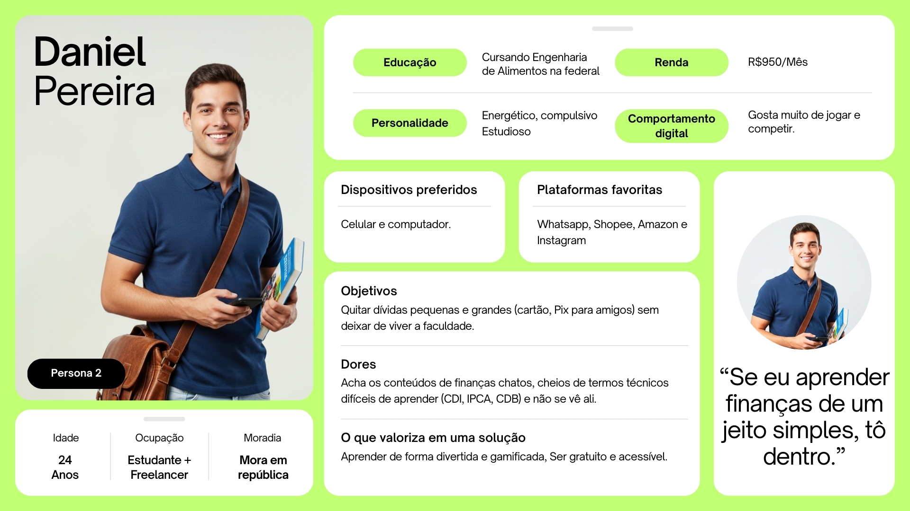<br>
 <sup>Fonte: Elaborado pelos autores (2025)</sup>
</div>
    
  Em conclusão, as personas mostram os diferentes perfis de jovens que o PoupaZenda atende e ajudam a garantir que cada parte do jogo seja relevante para suas necessidades reais. Elas guiam o design e a didática, permitindo que o jogo ofereça uma experiência prática e envolvente para todos os tipos de usuários.

## **2.10. Jornada do Usuário** 

  A jornada do usuário descreve, de forma simplificada, como cada persona interage com o PoupaZenda desde o primeiro contato até a evolução dentro do jogo. Ela mostra os passos, decisões e aprendizados que o jogador vivencia, evidenciando como as mecânicas do jogo transformam conceitos financeiros em experiências práticas e significativas. Ao mapear essa jornada, garantimos que o aprendizado seja fluido, intuitivo e conectado às necessidades reais de cada perfil.

<div align="center">
 <sub>Figura 14 - Jornada de usuário da Beatriz Nogueira</sub><br><br>
 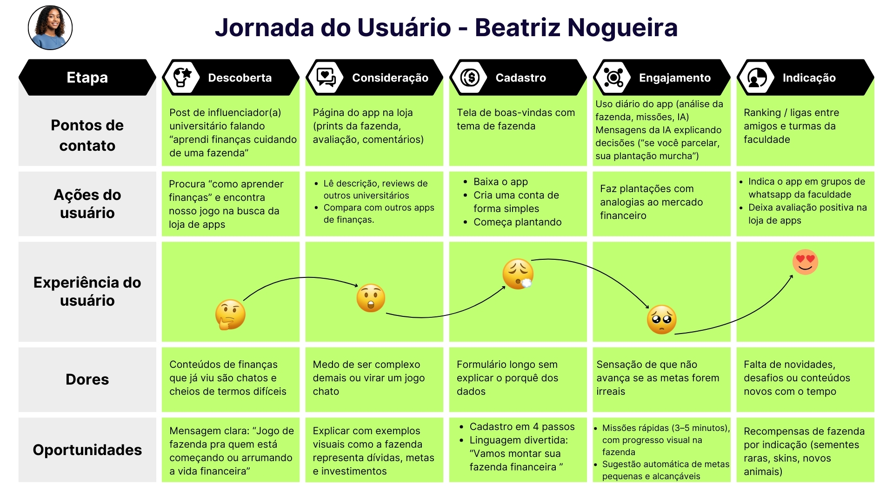<br>
 <sup>Fonte: Elaborado pelos autores (2025)</sup>
</div>

<div align="center">
 <sub>Figura 15 - Jornada de usuário do Daniel Pereira</sub><br><br>
 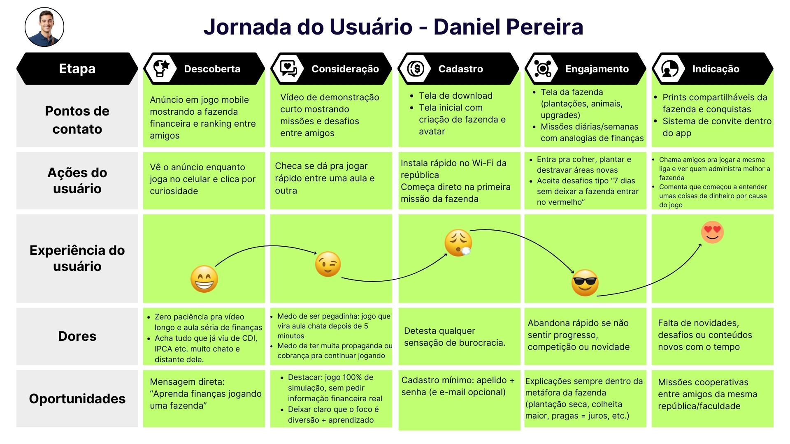<br>
 <sup>Fonte: Elaborado pelos autores (2025)</sup>
</div>

  Cada jornada de usuário revela, na prática, como as ações escolhidas se traduzem em progresso ou desafio na fazenda, tornando o aprendizado financeiro algo fácil de absorver. No fim, o jogador leva para fora do jogo uma compreensão real do impacto de suas decisões, pronto para aplicar esses hábitos positivos na própria vida.

## **2.11. Canva da Proposta de Valor**

  A Proposta de Valor representa o conjunto de benefícios que uma solução oferece para atender às necessidades reais do seu público. Ela descreve como o produto resolve problemas específicos, gera ganhos relevantes e entrega valor de forma única para estruturar essa proposta de forma visual, objetiva e estratégica.

  O Canvas e Proposta de Valor é uma ferramenta que conecta diretamente o que o usuário precisa com o que o produto oferece, permitindo garantir alinhamento entre dores, expectativas e funcionalidades. Ele é dividido em duas partes principais:

* **Perfil do Cliente**, que apresenta tarefas, dores e ganhos;  
* **Mapa de Valor**, que descreve produtos, aliviadores de dor e criadores de ganho.

  Ao integrar essas duas dimensões, o framework assegura que o PoupaZenda entregue exatamente o que os jovens precisam para aprender finanças de forma prática. Trata-se de um instrumento essencial para orientar o design do produto, validar decisões e reforçar a proposta de valor que guia todo o desenvolvimento da solução.

<div align="center">
 <sub>Figura 16 - Canva proposta de valor do Poupazenda</sub><br><br>
 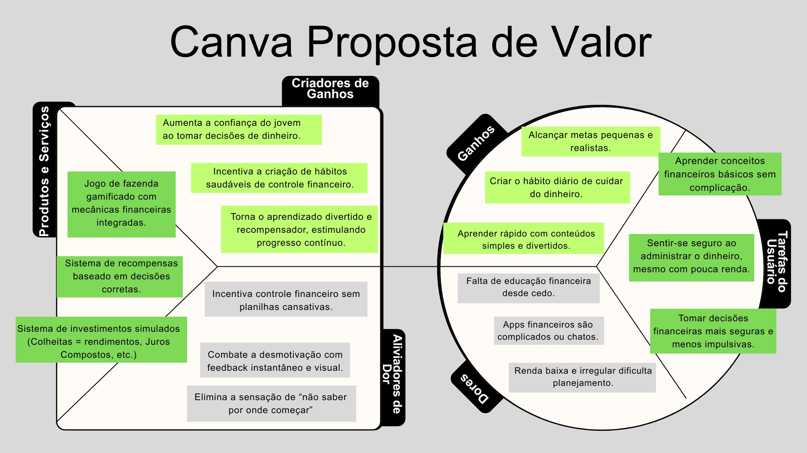<br>
 <sup>Fonte: Elaborado pelos autores (2025)</sup>
</div>


### **2.11.1 Produtos e Serviços**

* **Jogo de fazenda gamificado com mecânicas financeiras integradas**

O jogo transforma conceitos financeiros complexos em ações práticas e visuais dentro da fazenda. Isso facilita o entendimento porque os jovens aprendem melhor por meio de experiências interativas, e não por teoria abstrata. A fazenda funciona como uma metáfora concreta para investimento, poupança e planejamento.

* **Sistema de recompensas baseado em decisões corretas**

O usuário recebe recompensas conforme toma boas decisões financeiras dentro do jogo. Essa mecânica reforça comportamentos positivos e mantém o jogador engajado. A lógica de recompensa é essencial para criar motivação contínua em um público que costuma abandonar conteúdos tradicionais de finanças.

* **Sistema de investimentos simulados (Colheitas \= rendimentos, Juros Compostos, etc.)**

Cada plantação gera lucros diferentes, simulando investimentos reais. Isso ajuda o jovem a compreender conceitos abstratos como juros compostos, risco e retorno, visualizando o crescimento na prática.

### **2.11.2. Criadores de Ganhos** 

* **Aumenta a confiança do jovem ao tomar decisões de dinheiro**

O jogo permite que o usuário teste escolhas financeiras em um ambiente seguro. A prática constante aumenta a confiança, algo que muitos jovens não têm por falta de experiência ou medo de errar na vida real.

* **Incentiva a criação de hábitos saudáveis de controle financeiro**

As mecânicas diárias da fazenda estimulam constância. Com o tempo, o jogador aprende que cuidar do dinheiro exige rotina, não ações isoladas.

* **Torna o aprendizado divertido e recompensador, estimulando progresso contínuo**

Ao transformar finanças em algo lúdico, o jogo elimina a percepção de que educação financeira é chata. Isso facilita a permanência e reduz a evasão.

### **2.11.3. Aliviadores de Dor**

* **Incentiva controle financeiro sem planilhas cansativas**

Em vez de tabelas e números frios, o jogo utiliza interações visuais e acessíveis. Isso remove a sensação de dificuldade e diminui a barreira inicial para aprender finanças.

* **Combate a desmotivação com feedback instantâneo e visual**

A fazenda reage imediatamente às escolhas do jogador. Esse retorno rápido aumenta o engajamento e mantém o jovem interessado, combatendo a frustração que normalmente ocorre quando não se vê resultado imediato.

* **Elimina a sensação de “não saber por onde começar”**

O jogo guia o usuário passo a passo, tornando o aprendizado intuitivo. Isso resolve a principal dor dos jovens: a falta de direção no começo da jornada financeira.

### **2.11.4. Ganhos** 

* **Alcançar metas pequenas e realistas**

O jogo divide progresso em pequenas tarefas. Isso ajuda o jovem a visualizar resultados e evita desistência, já que metas pequenas são mais fáceis de manter.

* **Criar o hábito diário de cuidar do dinheiro**

A dinâmica da fazenda reforça continuidade. O jovem percebe que resultados financeiros dependem de constância, não de ações únicas.

* **Aprender rápido com conteúdos simples e divertidos**

O design intuitivo faz com que o entendimento aconteça de forma natural. Isso reduz o desinteresse por conteúdos teóricos.

* **Aprender conceitos financeiros básicos sem complicação**

Finanças são inseridas dentro das mecânicas do jogo. Assim, o usuário aprende sem a sensação de estar estudando algo técnico.

### **2.11.5. Dores** 

* **Falta de educação financeira desde cedo**

A maioria dos jovens não recebeu orientação financeira antes da vida adulta. Isso gera insegurança, impulsividade e dificuldade para lidar com dinheiro.

* **Apps financeiros são complicados ou chatos**

Ferramentas tradicionais são técnicas e pouco atraentes, o que faz o jovem desistir rapidamente.

* **Renda baixa e irregular dificulta planejamento**

Grande parte do público lida com renda variável. Isso gera ansiedade e impede a criação de um plano financeiro consistente.

### **2.11.6. Tarefas do Usuário**

* **Aprender conceitos financeiros básicos sem complicação**

O jovem quer entender o essencial rapidamente, sem tecnicismos ou linguagem difícil.

* **Sentir-se seguro ao administrar o dinheiro, mesmo com pouca renda**

A falta de estabilidade gera medo. O jogo ajuda a desenvolver segurança emocional e racional.

* **Tomar decisões financeiras mais seguras e menos impulsivas**

O usuário busca tomar decisões melhores, evitar dívidas e controlar impulsos de consumo. O jogo treina essa habilidade ao mostrar consequências de cada escolha.

 O Canvas de Proposta de Valor mostra que o PoupaZenda atende de forma precisa às necessidades dos jovens e supera limitações da educação financeira tradicional. Com gamificação e metáforas visuais, o jogo converte conceitos complexos em experiências simples, reduzindo barreiras de aprendizado e fortalecendo a confiança do usuário.

#  <a name="c3"></a> **3 Arquitetura da Solução** 

A solução adota uma arquitetura **server-authoritative em tempo real** baseada em Colyseus, com salas privadas persistentes por jogador. Apesar de ser um jogo single-player, toda lógica de negócio, economia e eventos macroeconômicos rodam exclusivamente no servidor, garantindo integridade absoluta e sincronização em tempo real com dados reais do mercado brasileiro.

## **3.1. Visão Geral** 

O diagrama abaixo ilustra a topologia da solução PoupaZenda. A arquitetura segrega a camada de apresentação (**Híbrida: Phaser \+ React**) da camada de simulação (**Server-Authoritative com Colyseus**). Observe o fluxo de dados bidirecional via WebSockets e a integração com microsserviços externos de Conteúdo (**IA**) que enriquecem o estado do jogo.

<div align="center">
 <sub>Figura 17 - Diagrama da arquitetura do Poupazenda</sub><br><br>
 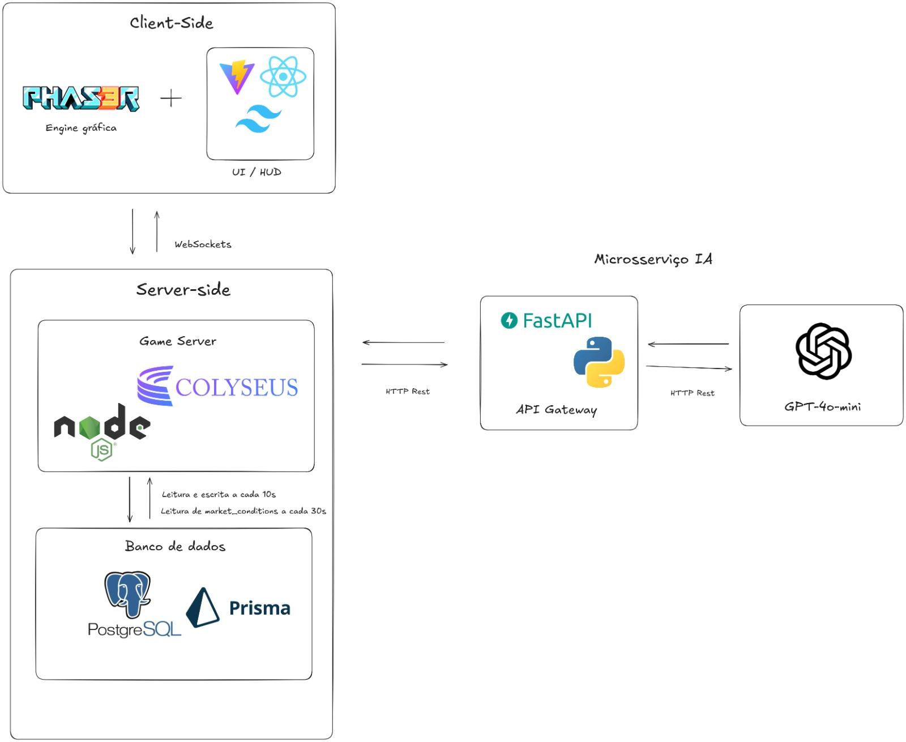<br>
 <sup>Fonte: Elaborado pelos autores (2025)</sup>
</div>

Além disso, montou a seguinte tabela para representar a tech stack definida da solução:

<div align="center">
<sup>Tabela 3: Tech Stack do PoupaZenda</sup>
</div>

| Domínio | Tecnologia Principal | Função na Arquitetura |
| :---- | :---- | :---- |
| **Game Client** | **Phaser 3** (WebGL) | Renderização do mundo do jogo e simulação física no navegador (60fps). |
| **Interface (UI)** | **React** \+ **Tailwind CSS** | Gerenciamento de menus, formulários, acessibilidade e design responsivo (PWA). |
| **Game Server** | **Node.js** \+ **Colyseus** | Servidor autoritativo, gerenciamento de salas, sincronização de estado e *anti-cheat*. |
| **Persistência** | **PostgreSQL** \+ **Prisma** | Armazenamento híbrido (Relacional para saldo, JSONB para grid) com integridade ACID. |
| **Inteligência** | **Python** \+ **FastAPI** | Microsserviços de gateway de IA. |
| **Generative AI** | **OpenAI** (GPT-4o-mini) | Geração procedural de conteúdo educativo e tutor virtual. |

<div align="center">
<sup>Fonte: Material produzido pelos autores (2025)</sup>
</div>

## 3.2.Estrutura de Front-end: Arquitetura Híbrida (Canvas + DOM)

Para garantir uma experiência de jogo imersiva (60fps) sem sacrificar a acessibilidade e a rapidez no desenvolvimento de interfaces complexas, adotamos uma arquitetura de **Sobreposição de Camadas (Layered Architecture)**. O núcleo do jogo é renderizado em WebGL, enquanto a interface do usuário (HUD) reside no DOM.

### **3.2.1. Game Engine Visual (Phaser 3\)**

* **Implementação:** O núcleo de simulação e renderização do jogo opera sobre a engine Phaser 3, integrada de forma modular à aplicação React.  
* **Justificativa Técnica (Escalabilidade & Qualidade):**  
  1. **Escalabilidade de Renderização:** Cenários de fazenda tendem a evoluir para centenas de entidades simultâneas (plantas, animais, decorativos). A renderização baseada em DOM (HTML/React) apresenta degradação de performance linear conforme o número de elementos aumenta. A adoção do Phaser 3 via Canvas/WebGL elimina esse gargalo, permitindo a exibição de alta densidade de objetos com consumo de memória constante e otimizado, essencial para dispositivos móveis.  
  2. **Fluidez e Precisão do Game Loop:** Aplicações de UI reativas não são projetadas para animações contínuas e complexas. A engine fornece um *Game Loop* dedicado, responsável por calcular atualizações de física e de movimento a 60 quadros por segundo. Isso assegura uma experiência visual fluida e consistente, livre de "travamentos" comuns em animações CSS sob alta carga.  
  3. **Robustez e Manutenibilidade:** A utilização de sistemas nativos da engine para gerenciamento de câmera (zoom/pan), detecção de input e ciclo de vida de cenas reduz a complexidade do código customizado. Ao delegar essas responsabilidades para uma ferramenta especializada e validada pelo mercado, aumenta-se a estabilidade do software e reduz-se a superfície de bugs técnicos.

### 3.2.2. Interface de Usuário e HUD (React \+ Vite)**

* **Implementação:** A camada de interface (HUD, menus, inventários e formulários) é desenvolvida em React, sobreposta à camada de renderização do jogo via posicionamento absoluto, gerenciada pelo *bundler* Vite.  
* **Justificativa Técnica (Escalabilidade & Qualidade):**  
  1. **Especialização e Separação de Responsabilidades:** Enquanto engines gráficas são otimizadas para renderização de sprites e física, elas apresentam limitações severas na construção de interfaces ricas (tabelas de dados, formulários complexos, listas roláveis). A utilização do React para a UI delega a renderização de texto e controles ao DOM, permitindo o aproveitamento do ecossistema de componentes web para resolver problemas de interface de forma eficiente e padronizada.  
  2. **Acessibilidade Semântica (a11y):** A renderização de interfaces dentro de um Canvas (WebGL) oculta o conteúdo de tecnologias assistivas. Ao desacoplar a UI para o DOM, preserva-se a árvore semântica HTML, garantindo compatibilidade nativa com leitores de tela e navegação por teclado. Isso assegura que o produto atenda a requisitos de inclusão digital e conformidade com normas WCAG.  
  3. **Gerenciamento de Estado Reativo:** A arquitetura do React, baseada em fluxo de dados unidirecional e reconciliação eficiente, é ideal para gerenciar o estado mutável da interface (ex: saldo de moedas, atualizações de inventário em tempo real).

### **3.2.3. Estilização: Tailwind CSS**

A escolha pelo Tailwind implementa uma arquitetura atômica que estabiliza o tamanho do *bundle*, evitando que o arquivo de estilos cresça descontroladamente conforme o projeto escala.

## **3.3. Estratégia de Comunicação e Sincronização (Client-Server)** 

A comunicação entre o navegador e o servidor é feita em tempo real exclusivamente por WebSocket, gerenciada pelo framework Colyseus (com fallback automático para conexões mais lentas quando necessário).

### **3.3.1. Padrão de Interação: Comandos \+ Servidor como Única Fonte de Verdade**

* **Implementação:** O jogador nunca altera diretamente o dinheiro, as plantas ou o terreno. Ele apenas envia comandos simples como:  
  * “Quero plantar CDB no terreno 12”  
  * “Quero colher os juros do terreno 8”  
* **Justificativa Técnica**  
  1. **Segurança total**: O servidor verifica tudo antes de aceitar: saldo suficiente? A planta já cresceu? A inflação permite esse preço? Só depois disso a ação é efetivada.  
  2. **Impossibilidade de trapaça**: Mesmo que alguém tente modificar o jogo no navegador, o servidor ignora comandos inválidos.  
  3. **Registro automático de todas as operações**: Cada comando válido vira uma linha permanente no extrato financeiro do jogador (game\_ledger), permitindo que ele veja exatamente como ganhou ou gastou cada real virtual.

### **3.3.2. Gerenciamento de Latência: Atualização Otimista com Reconciliação** 

* **Implementação**: Quando o jogador clica em “colher”, o jogo já mostra imediatamente as moedas entrando na carteira e a planta desaparecendo — sem esperar resposta do servidor.  
* **Justificativa Técnica**  
  1. **Sensação instantânea:** O jogo parece rodar offline; o clique responde na hora, mesmo com internet lenta.  
  2. **Correção automática:** Se o servidor descobrir que a planta ainda não estava pronta (ou o jogador estava sem saldo), ele envia uma correção em milissegundos e o jogo desfaz a ação com animação suave \+ mensagem educativa (“Você tentou colher antes da hora, isso é como resgatar um investimento com multa\!”).

### **3.3.3. Otimização de Tráfego: Sincronização Inteligente (Colyseus Deltas)** 

* **Implementação:** A arquitetura adota o sistema de Deltas nativo do Colyseus para realizar atualizações parciais de estado. Em vez de retransmitir o mapa completo da fazenda a cada ciclo, o servidor envia apenas os fragmentos de dados que sofreram alteração.  
  * *Exemplo:* Envio exclusivo da instrução *"O milho do quadrado 5 cresceu"*, em substituição à retransmissão de toda a lista de terrenos.  
* **Justificativa Técnica:**  
  1. **Economia de Dados (Democratização do Acesso):** A estratégia reduz o consumo de banda em até 90%. Esse fator é determinante para viabilizar a jogabilidade em conexões móveis limitadas (3G/4G), garantindo o acesso contínuo sem o esgotamento precoce do plano de dados do usuário.  
     2. **Bateria e Performance:** O processamento de pacotes de dados reduzidos diminui a carga de trabalho do processador do celular. O resultado prático é a preservação da autonomia da bateria (evitando superaquecimento) e a manutenção de uma performance fluida, mesmo em dispositivos móveis de entrada.

### **3.3.4. Contrato de Dados: Tipagem Ponta a Ponta (End-to-End Type Safety)**

* **Implementação:** Foi estabelecido um Contrato de Dados Unificado baseado em TypeScript. Através de DTOs (*Data Transfer Objects*) compartilhados, define-se estritamente a estrutura de comunicação, garantindo que Frontend e Backend operem sob as mesmas definições de esquema.  
* **Justificativa Técnica:**  
  1. **Segurança em Tempo de Compilação:** O sistema impõe uma barreira de integridade automática. Discrepâncias de tipo (ex: envio de string em campo numérico) impedem a compilação do código, prevenindo falhas de *Runtime* e fechamentos inesperados da aplicação no dispositivo do usuário.  
  2. **Integridade Semântica:** A unificação dos modelos de dados elimina inconsistências de integração entre sistemas distribuídos. Isso assegura a interoperabilidade precisa entre cliente e servidor, erradicando bugs silenciosos que poderiam comprometer a consistência do saldo financeiro ou do inventário do jogador.

## **3.4. Backend – Servidor Authoritative do Jogo (Colyseus)**

O servidor de jogo é implementado com Colyseus 0.15+, framework open-source consolidado como referência mundial para jogos web multiplayer autoritativos em 2025\. É a mesma tecnologia que sustenta grandes sucessos da Poki, CrazyGames, Voodoo e dezenas de títulos virais com milhões de jogadores simultâneos.

### **3.4.1 Arquitetura de Rooms (Salas Privadas por Jogador)** 

* **Implementação:** Cada jogador tem uma sala virtual exclusiva e persistente que armazena todo o estado da sua fazenda: terrenos, plantas, animais, carteira, dívidas, inventário e progresso educativo.  
* **Justificativa Técnica:**  
  1. **Isolamento absoluto:** Um jogador nunca consegue ver ou alterar a fazenda de outro.  
  2. **Escalabilidade natural:** Milhares de salas rodam em paralelo sem interferência, permitindo crescimento orgânico do número de usuários.  
  3. **Reconexão instantânea:** Se o celular perder a internet e voltar, o jogador continua exatamente de onde parou.

### **3.4.2 Simulation Loop Determinístico (Ciclo de Simulação no Servidor)** 

* **Implementação:** O servidor executa um loop fixo de 20 atualizações por segundo, responsável pelo crescimento das plantas, aplicação de juros, variação climática e efeitos da inflação.  
* **Justificativa Técnica:**  
  1. **Regras idênticas para todos:** O tempo passa do mesmo jeito para quem tem internet rápida ou lenta.  
  2. **Economia justa:** O rendimento de um CDB ou o preço das sementes nunca depende da qualidade da conexão do jogador.

### **3.4.3 Persistência Híbrida (Hot \+ Cold Data)**

* **Implementação:**  
  1. Durante o jogo: estado da fazenda fica em memória rápida da sala.  
  2. A cada 10 segundos e ao sair: todo o progresso é salvo automaticamente no PostgreSQL via Prisma.  
  3. Todas as movimentações financeiras são registradas de forma imutável no ledger.  
* **Justificativa Técnica:**  
  1. **Eficiência de Escrita (Write-Behind):** O uso do padrão *Write-Behind* desacopla a latência do banco de dados da experiência do jogador. Ações como plantar e colher têm latência média inferior a 8ms.  
  2. **Segurança bancária:** Saldos e histórico nunca se perdem, mesmo se o servidor cair.  
  3. **Recuperação total:** O jogador pode fechar o navegador por dias e voltar com a fazenda intacta.

### **3.4.4 Segurança e Proteção Anti-Trapaça Nativa**

* **Implementação:**  
  1. Autenticação obrigatória via JWT no momento da conexão WebSocket.  
  2. Limite automático de comandos por segundo por jogador.  
  3. Validação rigorosa de cada ação contra o estado real do servidor.  
  4. Regras de dados (schemas) impostas automaticamente em ambos os lados.  
* **Justificativa Técnica:**  
  1. **Trapaça praticamente impossível:** Técnicas comuns como acelerar o tempo, editar pacotes ou duplicar dinheiro são bloqueadas por padrão.  
  2. **Mesmos mecanismos de jogos comerciais:** A mesma proteção usada em títulos que faturam milhões está ativa desde o primeiro dia do projeto.

### **3.4.5 Catálogo de Mensagens (Protocolo de Jogo)** 

A comunicação entre Frontend e Backend ocorre exclusivamente via troca de mensagens tipadas, eliminando a necessidade de rotas HTTP REST. Abaixo, listamos os principais contratos de interação definidos no Schema do Colyseus.

**A. Comandos de Jogabilidade (Client \-\> Server)**

<div align="center">
<sup>
Tabela 4: Mensagens para as ações do jogo
</sup>
</div>

| Tipo de Mensagem | Payload (Dados Enviados) | Lógica de Processamento (Room Handler) |
| :---: | :---: | ----- |
|  PLANT\_REQ |  { position: 4, seedId: "corn\_cdb" } | 1\. Valida se o tile está vazio e se o saldo é suficiente. 2\. Desconta moedas atomicamente. 
3\. Instancia o objeto Crop no estado da sala e inicia o timer de crescimento baseado na Selic atual. |
|  HARVEST\_REQ |  { position: 12 } | 1\. Verifica no servidor se serverTime \>= harvestTime (evita speed hacks).

2\. Calcula o rendimento final (Yield).

3\. Remove a planta e credita XP/Moedas ao jogador. |
| PAY\_DEBT\_REQ | { debtId: "credit\_card\_1" } | 1\. Valida saldo disponível. 
2\. Remove a entidade "Dívida" (Praga) do mapa. 
3\. Aplica buff de "Score Limpo" que reduz o custo de novos itens. |
|  QUIZ\_ANSWER |  { quizId: "q\_105", option: "B" } | 1\. Valida a resposta contra o gabarito. 
2\. Se correto, desbloqueia a semente associada no Inventário (ex: libera compra de Tesouro Direto). |

<div align="center">
<sup>
Fonte: Material produzido pelos autores (2025)
</sup>
</div>


**B. Eventos de Sistema (Server \-\> Client)**

<div align="center">
<sup>
Tabela 4: Mensagens para os eventos do jogo
</sup>
</div>  

| Tipo de Mensagem | Payload (Dados Recebidos) | Comportamento no Frontend |
| ----- | ----- | ----- |
|  WEATHER\_CHANGE |  { condition: "RAINY", bonus: 1.2 } | Altera o visual da fazenda para chuvoso e mostra ícones de "Bônus de Crescimento" sobre as plantas de Renda Fixa. |
|  SYNC\_ERROR |  { code: "INSUFFICIENT\_FUNDS" } | **Rollback:** Caso a UI Otimista tenha mostrado uma compra que falhou no servidor, este evento força a UI a reverter ao estado real e exibe o motivo. |

<div align="center">
<sup>
Fonte: Material produzido pelos autores (2025)
</sup>
</div>

## **3.5 Microsserviço de Inteligência Artificial (AI Content Engine)**

Este componente opera como um motor dedicado de inteligência, segregando o processamento pesado de LLMs do ciclo de vida crítico do servidor de jogo (*Game Loop*).

### **3.5.1 Arquitetura: Microservice Pattern (FastAPI)**

* **Implementação:** Desenvolvido em **Python (FastAPI)**, consumindo a API da **OpenAI (Modelo GPT-4o-mini)**. A escolha do modelo prioriza o equilíbrio entre baixo custo e latência (\< 1s) para interações em tempo real.  
* **Funcionalidades do Serviço:**  
  1. **Geração Procedural (Quizzes):**  
     * **Trigger:** A FarmRoom (Colyseus) detecta padrões de jogo (ex: endividamento) e solicita conteúdo assincronamente.  
     * **Processamento:** O serviço constrói um prompt contextual e valida o retorno via **Pydantic**, garantindo integridade estrutural.  
     * **Entrega:** O JSON validado é injetado no estado da sala e sincronizado via *Delta Patch*.  
  1. **Consultoria Ativa (Chatbot NPC):**  
     * **Interação:** Habilita conversas livres com o "Professor Fininho" (o mesmo mentor dos quizzes).  
     * **Contexto (RAG):** O prompt de chat recebe, além da pergunta do usuário, o **Estado Atual da Fazenda** e **Indicadores de Mercado** (Selic/IPCA), permitindo conselhos estratégicos (ex: *"Com a Selic alta, melhor plantar Milho do que pegar empréstimo"*).  
*  **Justificativa Técnica (Performance & Robustez)**  
1. **Proteção do Tick Rate (Non-Blocking I/O):** A geração de texto via LLM é lenta (segundos). Ao isolar essa lógica em um microsserviço, garantimos que o **Simulation Loop** do Colyseus (que roda a 20 ticks/segundo) nunca seja bloqueado aguardando uma resposta da IA, mantendo a movimentação e interação fluida para todos os jogadores na sala.  
2. **Ecossistema Nativo de IA:** A escolha do Python permite o uso nativo de bibliotecas avançadas de engenharia de prompt (LangChain) e validação de dados (Pydantic), facilitando a implementação de lógicas complexas que seriam ineficientes em Node.js.  
3. **Type Safety na Fronteira:** O uso de modelos Pydantic no Python garante que o JSON retornado para o Colyseus siga estritamente o formato esperado pelo Schema do jogo, prevenindo que "alucinações" da IA corrompam o estado da sala.

### 3.5.2. Exemplo de Engenharia de Prompt (System Prompt) 

Abaixo, o template real utilizado para instanciar a persona "Caseiro” e forçar a saída estruturada:

```
Você é o Professor Caseiro, o mentor financeiro da PoupaZenda, um professor brasileiro extremamente didático, paciente e motivador que fala como um jovem de 25-30 anos (gíria leve, tom leve, nunca pedante). 
Sua única missão é ajudar o jogador a aprender educação financeira de forma personalizada, com base no contexto que receber.
Regras rígidas (nunca quebre nenhuma delas): 
1. Sempre responda APENAS com um JSON válido, sem nenhum texto antes ou depois. 
2. O JSON deve seguir exatamente este schema (não invente campos novos): 
{   
  "question": "string", // pergunta clara e objetiva
  
  "options": ["A) texto", "B) texto", "C) texto", "D) a"],  // exatamente 4 opções 
  "correct": 0,          // índice da alternativa correta (0 = A, 1 = B, 2 = C, 3 = D)
  "explanation": "string",      // 1 a 3 frases curtas, motivadoras e didáticas 
  "difficulty": "easy" | "medium" | "hard",     // baseado no nível do jogador
  "topic": "string"                    // ex: "juros compostos", "reserva", "inflação" 
} 

Contexto do jogador (use TODAS as informações para criar a pergunta mais útil possível): {player_context} 

Crie UMA pergunta que ensine exatamente o conceito financeiro que esse jogador mais precisa aprender AGORA. Seja direto, use exemplos reais do dia a dia brasileiro (Selic, IPCA, CDB, Tesouro) e termine a explicação sempre com tom positivo e encorajador. Responda SEMPRE com JSON válido e NUNCA inclua markdown, código ou texto adicional. 
```

## **
** 	**3.6  Estrutura de Banco de Dados (Persistence Layer)**

Adotamos uma **Arquitetura Híbrida** utilizando **PostgreSQL** gerenciado pelo **Prisma**. Essa escolha une o rigor de uma fintech com a flexibilidade de um jogo: utilizamos tabelas relacionais estritas para garantir a segurança absoluta do saldo e das transações (padrão **ACID/Ledger**), enquanto aproveitamos colunas **JSONB** para armazenar o mapa dinâmico da fazenda. Isso nos permite ter a integridade financeira de um banco e a performance de leitura de um NoSQL na mesma infraestrutura.

### **3.6.1 Detalhamento das Entidades (Schema)**

Abaixo apresentamos o esquema relacional proposto, desenhado para garantir integridade referencial nas finanças e flexibilidade na mecânica de jogo.

**1\. Entidade: game\_profiles (Perfil do Jogador)**

Armazena a progressão do usuário e meta-dados de nível.

* **id** (UUID, PK): Identificador único do perfil no jogo.  
* **auth\_id** (String, Unique): Vínculo com o sistema de autenticação (ex: Firebase Auth/Auth0).  
* **nickname** (String): Nome de exibição na fazenda.  
* **level** (Int): Nível atual da fazenda (ex: 1-99).  
* **experience** (BigInt): Pontos de XP acumulados.  
* **created\_at** (Timestamp): Data de início da jornada.

**2\. Entidade: game\_wallets (Carteira)**

  Segrega os saldos do usuário por tipo de moeda, permitindo expansão futura (ex: Moeda Premium).

* **id** (UUID, PK): Identificador da carteira.  
* **profile\_id** (UUID, FK): Referência ao Perfil do Jogador.  
* **currency** (Enum): Tipo da moeda ('HARVEST\_COIN', 'PREMIUM\_GEM').  
* **balance** (Decimal 14,2): Saldo atual. **Nota:** Utilização de tipo Decimal para evitar erros de ponto flutuante em cálculos financeiros.  
* **updated\_at** (Timestamp): Última modificação de saldo.

**3\. Entidade: game\_ledger (Extrato / Livro Razão)**

  Registro imutável de todas as movimentações financeiras para auditoria e didática.

* **id** (UUID, PK): Identificador da transação.  
* **wallet\_id** (UUID, FK): Referência à carteira afetada.  
* **amount** (Decimal 14,2): Valor da movimentação (positivo para crédito, negativo para débito).  
* **operation\_type** (Enum): Categoria ('HARVEST\_REWARD', 'SHOP\_PURCHASE', 'DEBT\_INTEREST', 'MARKET\_EVENT').  
* **description** (String): Descrição legível para o extrato (ex: "Venda de Milho (Tesouro)").  
* **created\_at** (Timestamp): Momento exato da transação.

**4\. Entidade: farm\_states (Estado do Jogo)**

  Armazena o mapa da fazenda utilizando estrutura flexível para performance.

* **profile\_id** (UUID, PK, FK): Chave primária vinculada ao jogador (1:1).  
* **last\_synced\_at** (Timestamp): Último momento que o cliente sincronizou com o servidor (usado para cálculo de DeltaTime).  
* **grid\_data** (**JSONB**): Coluna binária contendo a matriz de tiles.  
  * *Estrutura Interna:* Array de objetos contendo { x, y, item\_id, state, planted\_at\_timestamp }.

**5\. Entidade: inventory\_items (Inventário)**

  Itens comprados ou ganhos que ainda não foram utilizados no grid.

* **id** (UUID, PK): Identificador do registro.  
* **profile\_id** (UUID, FK): Dono do item.  
* **item\_type** (String): Código do item (ex: 'seed\_cdb\_xp', 'tool\_plow').  
* **quantity** (Int): Quantidade disponível.

**6\. Entidade: education\_progress (Trilha Educativa)**

  Rastreia o aprendizado do usuário para liberar mecânicas de jogo avançadas.

* **id** (UUID, PK): Identificador do progresso.  
* **profile\_id** (UUID, FK): Aluno.  
* **module\_id** (String): Identificador do módulo (ex: 'module\_fixed\_income').  
* **status** (Enum): Estado ('LOCKED', 'IN\_PROGRESS', 'COMPLETED').  
* **quiz\_score** (Int): Nota obtida na avaliação final do módulo.  
* **completed\_at** (Timestamp): Data de conclusão.

Para facilitar a visualização da estrutura no banco de dados, montou-se o seguinte esquema:

<div align="center">
<sup>
Figura 17: Diagrama do banco de dados.
</sup>
<br>


<br>
<sup>
Fonte: Material produzido pelos autores (2025)
</sup>
</div>

#  <a name="c4"></a> **4\. Viabilidade e próximos passos**

Esta seção demonstra a viabilidade econômica, técnica e estratégica do **PoupaZenda**, alinhando o produto aos objetivos de negócio da XP Inc. e mapeando a evolução do projeto para garantir longevidade e mitigação de riscos.

## **4.1 Sustentabilidade e Geração de Valor (Business Case)** -de-valor-(business-case)}

A viabilidade do PoupaZenda não se baseia na venda direta do jogo, mas sim na sua capacidade de atuar como uma ferramenta de **Aquisição e Retenção (CAC & LTV)** dentro do ecossistema XP.

* **Redução do Custo de Aquisição (CAC):** O jogo atua como um "topo de funil" gamificado. Ao atrair o público jovem (18-30 anos) através de entretenimento, reduz-se a barreira de entrada para a abertura de contas na **Rico** ou **XP**, convertendo jogadores em correntistas de forma orgânica e educativa.  
* **Educação como Motor de LTV:** Um cliente educado investe melhor e por mais tempo. Ao ensinar sobre produtos reais (CDB, Tesouro, FIIs) dentro do jogo, cria-se uma demanda natural pelos produtos de investimento da corretora, aumentando o *Share of Wallet* do usuário ao longo da vida.  
* **Impacto ESG (Instituto XP):** O projeto atende diretamente à missão social de democratizar a educação financeira, fortalecendo a marca XP como agente de transformação social e cumprindo metas de governança corporativa e impacto social.

## **4.2. Passos Futuro (Evolução do Jogo)** -(evolução-do-jogo)

Os itens abaixo descrevem funcionalidades planejadas para versões futuras do Poupazenda:

* **Desbloqueio de novas áreas da fazenda**
 

Ao atingir certos marcos (patrimônio, nível de XP ou missões concluídas), o jogador poderá liberar novas áreas do mapa, com tipos de plantio mais avançados e desafios financeiros adicionais.

* **Novos tipos de recursos financeiros**
  

Inclusão de novos plantios/ativos (ex.: investimentos internacionais, renda variável, produtos de proteção) com diferentes níveis de risco, prazo e retorno, ampliando o repertório de educação financeira.

* **Missões avançadas e campanhas temáticas**

Criação de linhas de missão mais complexas (campanhas), focadas em objetivos específicos, como reserva de emergência, organização de dívidas ou planejamento de longo prazo.

* **Eventos sazonais na fazenda**
  

Eventos limitados por tempo (ex.: “Semana da Reserva”, “Mês da Organização Financeira”), com recompensas especiais, quizzes temáticos e condições diferentes de mercado.

* **Expansão do caseiro IA**
  

Evolução do assistente para oferecer:

- Análises mais detalhadas das decisões do jogador  
- Sugestões de estratégias alternativas  
- Explicações com níveis diferentes de profundidade (iniciante, intermediário).


* **Melhorias de ranking e social**
  

Implementação de rankings por grupos (turmas, amigos) e desafios semanais, permitindo comparar desempenho de forma saudável e colaborar em metas coletivas.

* **Integração entre dispositivos / navegador**
  

Garantir que o progresso do jogador seja sincronizado em diferentes dispositivos e navegadores, permitindo continuar a experiência de qualquer lugar mantendo a mesma conta.

* **Ajustes de balanceamento contínuos**
 

Revisão recorrente de tempos de plantio, recompensas, dificuldades de quiz e progressão de missões com base em dados de uso e feedback dos jogadores.

* **Implementação de Inteligência de Mercado**  

Implementação de um sistema que conecta os rendimentos da fazenda a indicadores reais (como CDI, inflação etc.), ajustando automaticamente o desempenho das plantações e recursos (por exemplo: se o CDI cai, o alface rende menos), para que o jogador perceba na prática como mudanças econômicas impactam seus resultados no jogo.

* **Implementação de avatares**  

Implementar um sistema de escolha de avatares, permitindo que o jogador selecione aquele com o qual se sinta mais representado.

## **4.3 Matriz de Riscos e Mitigação** 

Atendendo ao critério de "Sustentabilidade e Riscos" do edital, mapeamos os principais desafios e suas soluções técnicas:

<div align="center">
<sup>
Tabela 5: Tabela de riscos e mitigação
</sup>
</div>

| Categoria de Risco | Descrição do Risco | Estratégia de Mitigação (Arquitetura) |
| :---- | :---- | :---- |
| **Técnico / Custo** | Custo elevado de LLM (OpenAI) com aumento de usuários. | **Caching & Rate Limiting:** Implementação de cache semântico no Redis para perguntas repetidas e limites de uso diário por usuário gratuito. |
| **Regulatório** | Privacidade de dados financeiros (se houver integração futura). | **Privacy by Design:** A arquitetura segrega dados de jogo (Colyseus) de dados sensíveis (Open Finance), utilizando criptografia de ponta a ponta e anonimização para análises de IA. |
| **Infraestrutura** | Latência em redes móveis 3G/4G instáveis. | **Arquitetura Híbrida:** O uso de *Client-Side Prediction* e *Delta Patches* (Colyseus) garante jogabilidade fluida mesmo com perda de pacotes ou alta latência. |

<div align="center">
<sup>
Fonte: Material produzido pelos autores (2025)
</sup>
</div>

#  <a name="c5"></a> 5\. REFERÊNCIAS 
**CNDL – Confederação Nacional de Dirigentes Lojistas.** Jovens e Controle Financeiro: Relatório Nacional de Endividamento Juvenil. Brasília, 2024\. *Arquivo fornecido pelo autor.*

**CENTRO PAULA SOUZA.** Relatório sobre Endividamento Juvenil e Educação Financeira. São Paulo, CPS, 2024\. *Arquivo fornecido pelo autor.*

**IBGE – Instituto Brasileiro de Geografia e Estatística.** Índice Nacional de Preços ao Consumidor Amplo (IPCA). Disponível em: [https://www.ibge.gov.br/](https://www.ibge.gov.br). Acesso em: 23 nov. 2025\.

**SPC BRASIL – Serviço de Proteção ao Crédito.** Educação Financeira 4.0: Relatório de Comportamento e Endividamento dos Jovens no Brasil. São Paulo, 2024\. *Arquivo fornecido pelo autor.*

## **5.1. REFERÊNCIAS TÉCNICAS** }

**COLYSEUS.** Multiplayer Framework for Node.js. Disponível em: [https://www.colyseus.io/](https://www.colyseus.io). Acesso em: 23 nov. 2025\.

**FASTAPI.** FastAPI Documentation – High Performance APIs. Disponível em: [https://fastapi.tiangolo.com/](https://fastapi.tiangolo.com). Acesso em: 23 nov. 2025\.

**OPENAI.** Documentação da API e modelos GPT. Disponível em: [https://platform.openai.com/docs/](https://platform.openai.com/docs/). Acesso em: 23 nov. 2025\.

**PHASER.** Phaser 3 – HTML5 Game Framework. Disponível em: [https://phaser.io/](https://phaser.io). Acesso em: 23 nov. 2025\.

**PRISMA ORM.** Prisma Documentation – Type-Safe ORM. Disponível em: [https://www.prisma.io/docs/](https://www.prisma.io/docs/). Acesso em: 23 nov. 2025\.

**REACT.** React – Biblioteca de Interface de Usuário. Disponível em: [https://react.dev/](https://react.dev). Acesso em: 23 nov. 2025\.